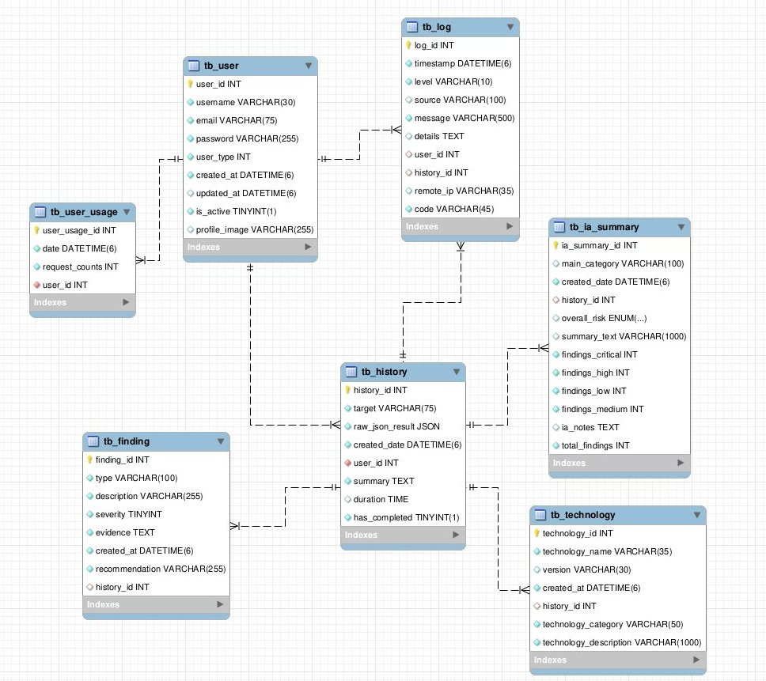
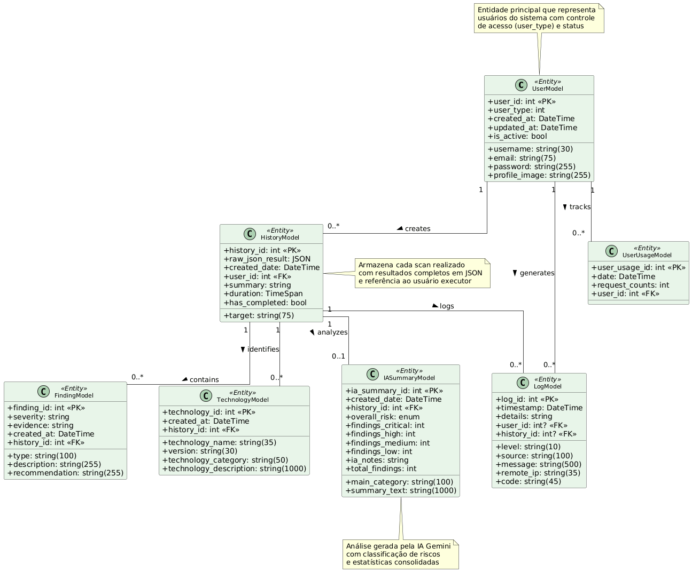

# HeimdallWeb - Plataforma de Análise de Segurança Web

<div align="center">
   
  
  
  
  
</div>

**HeimdallWeb** é uma aplicação de escaneamento e auditoria de segurança web, migrada de um monolito ASP.NET MVC para uma arquitetura moderna, performática e modular, utilizando **DDD-Light** com **Minimal APIs** no backend e **Next.js 15** no frontend.

---

## 🚀 Visão Geral

O projeto oferece uma plataforma robusta para identificação de vulnerabilidades, análise de configurações de segurança e geração de relatórios detalhados, agora com uma separação clara entre o backend, responsável pela lógica de negócio e processamento pesado, e o frontend, focado em uma experiência de usuário rica e reativa.

## ⚙️ Funcionalidades Detalhadas

### 🔍 Scanners Especializados

O HeimdallWeb possui **6 scanners especializados** que trabalham em conjunto para fornecer uma análise completa de segurança:

#### 1. **HeaderScanner** - Análise de Cabeçalhos HTTP
Verifica a presença e configuração adequada de cabeçalhos de segurança essenciais:
- `Strict-Transport-Security` (HSTS)
- `Content-Security-Policy` (CSP)
- `X-Frame-Options`
- `X-Content-Type-Options`
- `Referrer-Policy`
- `Permissions-Policy`
- Análise de cookies de sessão (flags `HttpOnly`, `Secure`, `SameSite`).

#### 2. **SslScanner** - Validação de Certificados SSL/TLS
- Valida certificados SSL/TLS em portas HTTPS (443).
- Verifica validade temporal, emissor e cadeia de confiança.
- Detecta certificados expirados, auto-assinados ou com algoritmos fracos (SHA-1).
- Analisa o tamanho da chave (RSA, DSA, ECDSA).

#### 3. **PortScanner** - Varredura e Identificação de Serviços
- Realiza scanning paralelo de **25 portas críticas**, capturando banners para fingerprinting de serviços e tecnologias.
- Portas monitoradas incluem: `21, 22, 80, 443, 3306, 5432, 8080`, etc.

#### 4. **HttpRedirectScanner** - Verificação de Redirecionamentos
- Testa se sites HTTP redirecionam adequadamente para HTTPS.
- Identifica configurações inseguras de redirecionamento (e.g., HTTP -> HTTP).
- Valida códigos de status apropriados (301, 302, 307, 308).

#### 5. **RobotsScanner** - Análise de `robots.txt`
- Analisa o arquivo `robots.txt` em busca de diretórios sensíveis expostos (`/admin`, `/backup`).
- Identifica configurações que podem revelar informações sobre a estrutura do site.

#### 6. **SensitivePathsScanner** - Detecção de Caminhos Sensíveis
- Busca por mais de **35 arquivos e diretórios sensíveis**, como `/.git`, `/.env`, `/phpinfo.php`, etc.
- Utiliza heurísticas para reduzir falsos-positivos, diferenciando páginas de erro customizadas de recursos realmente existentes.

### 🤖 Análise com Inteligência Artificial
- **Integração com Google Gemini AI** para análise contextual dos resultados brutos dos scanners.
- **Classificação automática de riscos** e geração de um resumo executivo em linguagem natural.
- **Recomendações de mitigação** personalizadas com base nos achados.

### 📊 Dashboard Administrativo
- **Métricas e KPIs globais** sobre o uso do sistema, scans realizados e vulnerabilidades encontradas.
- **Visualização de logs de auditoria** com filtros por nível e data.
- **Gerenciamento de usuários** (ativar, bloquear, deletar).
- Utiliza **SQL Views otimizadas** para consultas performáticas.

### 🔐 Autenticação e Autorização
- **Autenticação JWT** (JSON Web Tokens) com o token armazenado em **cookies HttpOnly e Secure**.
- **Sistema de roles** (Usuário e Admin) para controle de acesso granular aos endpoints da API.

---

## 🏛️ Arquitetura

O projeto foi reestruturado para seguir uma abordagem moderna, separando claramente as responsabilidades do frontend e backend.

<div align="center">

**Frontend (Next.js)** ➡️ **Backend (Minimal API)** ➡️ **Banco de Dados (PostgreSQL)**

</div>

### Backend (.NET)

O backend adota uma arquitetura limpa, inspirada nos princípios do **Domain-Driven Design (DDD-Light)** e **CQRS**.

-   `HeimdallWeb.Domain`: O núcleo do sistema. Contém as entidades, agregados, Value Objects e a lógica de negócio mais pura, sem dependências de infraestrutura.
-   `HeimdallWeb.Application`: A camada de orquestração. Utiliza o padrão **CQRS Light** com `Commands` (para escrita) e `Queries` (para leitura), DTOs e lógica de validação (FluentValidation).
-   `HeimdallWeb.Infrastructure`: Implementa as interfaces definidas no Domain. Contém o `DbContext` do Entity Framework Core, os **Repositories** para acesso a dados (PostgreSQL) e implementações de serviços externos.
-   `HeimdallWeb.WebApi`: A camada de apresentação do backend. Expõe a funcionalidade da aplicação através de **Minimal APIs**, lidando com requisições HTTP, autenticação e autorização.

### Frontend (Next.js)

-   `HeimdallWeb.Next`: Uma aplicação completa em **Next.js 15** com **App Router**. É responsável por toda a interface do usuário, garantindo uma experiência rica, reativa e otimizada com Server-Side Rendering (SSR) e Client Components.

## 🛠️ Tecnologias Utilizadas

| Camada | Tecnologia | Descrição |
| :--- | :--- | :--- |
| **Backend** |  | Framework principal para construção do backend. |
| | **ASP.NET Core Minimal APIs** | Para criação de endpoints HTTP leves e de alta performance. |
| | **Entity Framework Core 9** | ORM para interação com o banco de dados. |
| | **Npgsql** | Provedor de dados para PostgreSQL no EF Core. |
| | **MediatR** | Implementação do padrão CQRS para desacoplamento. |
| | **FluentValidation** | Para validações de regras de negócio de forma declarativa. |
| **Frontend** |  | Framework React para construção da interface de usuário. |
| | **React 19** | Biblioteca para construção de UIs. |
| | **TypeScript** | Superset do JavaScript que adiciona tipagem estática. |
| |  | Framework CSS para estilização utilitária. |
| | **shadcn/ui** | Componentes de UI reutilizáveis e acessíveis. |
| | **TanStack Query** | Gerenciamento de estado de servidor e cache de requisições. |
| **Banco de Dados**|  | Banco de dados relacional open-source. |
| **Integrações** | **Google Gemini AI** | API de inteligência artificial para análise de vulnerabilidades. |

## 📁 Estrutura de Diretórios

A estrutura do projeto foi organizada para refletir a arquitetura de software moderna.

```
/
├── 📂 src/
│   ├── 📂 HeimdallWeb.Application/   # Camada de Aplicação (Commands, Queries, DTOs)
│   ├── 📂 HeimdallWeb.Contracts/     # Contratos de API (Requests, Responses)
│   ├── 📂 HeimdallWeb.Domain/        # Camada de Domínio (Entities, Value Objects)
│   ├── 📂 HeimdallWeb.Infrastructure/  # Camada de Infraestrutura (EF Core, Repositories)
│   ├── 📂 HeimdallWeb.Next/          # Aplicação Frontend (Next.js)
│   └── 📂 HeimdallWeb.WebApi/        # API Backend (Minimal APIs)
│
├── 📂 tests/
│   ├── 📂 HeimdallWeb.Application.Tests/ # Testes para a camada de aplicação
│   ├── 📂 HeimdallWeb.Domain.Tests/      # Testes para a camada de domínio
│   └── 📂 HeimdallWeb.IntegrationTests/  # Testes de integração
│
├── 📄 HeimdallWeb.sln                 # Arquivo da Solution do Visual Studio
├── 📄 README.md                       # Documentação principal
└── 📄 .gitignore                      # Arquivos ignorados pelo Git
```

## 🚀 Como Executar o Projeto

Siga os passos abaixo para configurar e executar o ambiente de desenvolvimento local.

### Pré-requisitos

-   **[.NET 10 SDK](https://dotnet.microsoft.com/download/dotnet/10.0)** ou superior.
-   **[Node.js 20.x](https://nodejs.org/)** ou superior.
-   **[PostgreSQL](https://www.postgresql.org/download/)** (ou uma instância rodando em Docker).
-   **Chave de API do Google Gemini** ([Obter chave](https://makersuite.google.com/app/apikey)).

### 1. Configuração do Banco de Dados

Crie um banco de dados no PostgreSQL para a aplicação. Exemplo:

```sql
CREATE DATABASE db_heimdall;
```

### 2. Backend (API)

Abra um terminal e siga os passos:

```bash
# 1. Navegue para o diretório da WebApi
cd src/HeimdallWeb.WebApi

# 2. Configure suas credenciais em appsettings.Development.json
# - "ConnectionStrings": "..." (sua connection string do PostgreSQL)
# - "Jwt:Key": "gere uma chave segura com pelo menos 32 caracteres"
# - "GEMINI_API_KEY": "sua chave da API do Gemini"

# 3. Restaure as dependências do .NET
dotnet restore

# 4. Aplique as migrações do Entity Framework Core para criar as tabelas
dotnet ef database update

# 5. Execute a API (disponível em http://localhost:5110)
dotnet run
```

### 3. Frontend (Next.js)

Abra um **novo terminal** e siga os passos:

```bash
# 1. Navegue para o diretório do frontend
cd src/HeimdallWeb.Next

# 2. Instale as dependências do Node.js
npm install

# 3. Execute o servidor de desenvolvimento (disponível em http://localhost:3000)
npm run dev
```

### 4. Primeiro Acesso
1.  Acesse **`http://localhost:3000`** no seu navegador.
2.  Crie um novo usuário através da página de registro.
3.  Para promover seu primeiro usuário a **Administrador**, execute o seguinte comando SQL:
    ```sql
    UPDATE tb_user SET user_type = 2 WHERE user_id = 1;
    ```

### Solução de Problemas

-   **Erro de conexão com o banco de dados**: Verifique se sua connection string em `appsettings.Development.json` está correta e se o serviço do PostgreSQL está rodando.
-   **Erro de migração do EF Core**: Se encontrar problemas, você pode apagar o banco de dados e recriá-lo, depois rodar `dotnet ef database update` novamente.
-   **Erro de autenticação JWT**: Certifique-se de que a chave JWT em `appsettings` tem pelo menos 32 caracteres.

## 🖼️ Diagramas

### Diagrama do Banco de Dados



### Diagrama de Classe



## 🤝 Contribuição

Para questões técnicas ou problemas, sinta-se à vontade para abrir uma [issue no GitHub](https://github.com/alexscarano/HeimdallWeb/issues).

## 🔒 Segurança

Se você descobrir uma vulnerabilidade de segurança, **NÃO** abra uma issue pública. Entre em contato diretamente através do GitHub para que possamos endereçar o problema de forma responsável.

---
**Desenvolvido para auditoria e segurança de aplicações web corporativas.**

