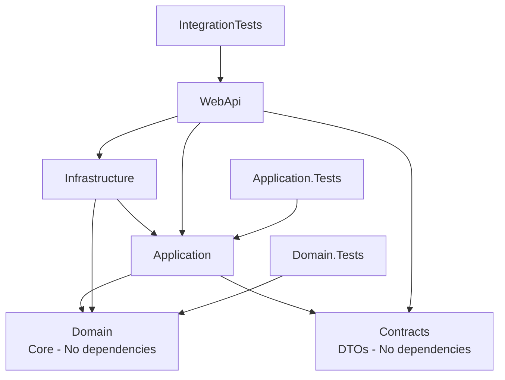

# 🏗️ Nova Estrutura - Migração HeimdallWeb

**Data de Criação:** 2026-02-04  
**Versão .NET:** 10.0  
**Status:** ✅ Estrutura de projetos criada e compilada

---

## 📦 Projetos Criados

### src/ (Projetos de Aplicação)

```
src/
├── HeimdallWeb.Domain/          # ✅ Criado - .NET 10
├── HeimdallWeb.Contracts/       # ✅ Criado - .NET 10
├── HeimdallWeb.Application/     # ✅ Criado - .NET 10
├── HeimdallWeb.Infrastructure/  # ✅ Criado - .NET 10
└── HeimdallWeb.WebApi/          # ✅ Criado - .NET 10
```

### tests/ (Projetos de Testes)

```
tests/
├── HeimdallWeb.Domain.Tests/        # ✅ Criado - xUnit
├── HeimdallWeb.Application.Tests/   # ✅ Criado - xUnit
└── HeimdallWeb.IntegrationTests/    # ✅ Criado - xUnit
```

---

## 🔗 Dependências Entre Projetos



---

## 📋 Solution Structure

**HeimdallWeb.sln** contém todos os projetos:

| # | Projeto | Tipo | Framework |
|---|---------|------|-----------|
| 1 | HeimdallWeb.Domain | Class Library | net10.0 |
| 2 | HeimdallWeb.Contracts | Class Library | net10.0 |
| 3 | HeimdallWeb.Application | Class Library | net10.0 |
| 4 | HeimdallWeb.Infrastructure | Class Library | net10.0 |
| 5 | HeimdallWeb.WebApi | Web API | net10.0 |
| 6 | HeimdallWeb.Domain.Tests | xUnit Test Project | net10.0 |
| 7 | HeimdallWeb.Application.Tests | xUnit Test Project | net10.0 |
| 8 | HeimdallWeb.IntegrationTests | xUnit Test Project | net10.0 |
| 9 | HeimdallWebOld | ASP.NET Core MVC | net8.0 (legacy) |

---

## ✅ Status de Compilação

```
Build succeeded.
    0 Error(s)
    23 Warning(s) - HeimdallWebOld only (nullability warnings)

Time Elapsed: 00:00:08.20
```

---

## 🎯 Próximos Passos

Conforme `plano_migracao.md`:

### **Fase 1: Domain Layer** (PRÓXIMA FASE)
- [ ] Criar 7 entidades (User, ScanHistory, Finding, Technology, IASummary, AuditLog, UserUsage)
- [ ] Criar 3 value objects (ScanTarget, EmailAddress, ScanDuration)
- [ ] Definir 7 interfaces de repositório
- [ ] Criar 3 exceções de domínio
- [ ] Copiar enums do projeto legado

### **Referências do Projeto Legado:**
- `HeimdallWebOld/Models/` → Entidades para extrair
- `HeimdallWebOld/Services/ScanService.cs` → Lógica de negócio
- `HeimdallWebOld/Interfaces/` → Contratos de interface
- `HeimdallWebOld/Enums/` → Enumeradores

---

## 🔧 Comandos Úteis

```bash
# Compilar solution completa
dotnet build HeimdallWeb.sln

# Restaurar dependências
dotnet restore

# Limpar outputs
dotnet clean

# Executar WebApi (quando implementado)
dotnet run --project src/HeimdallWeb.WebApi/HeimdallWeb.WebApi.csproj

# Executar todos os testes
dotnet test

# Adicionar pacote NuGet a um projeto
dotnet add src/HeimdallWeb.Infrastructure/HeimdallWeb.Infrastructure.csproj package Npgsql.EntityFrameworkCore.PostgreSQL
```

---

## 📊 Comparação: Legado vs Nova Estrutura

| Aspecto | HeimdallWebOld (Legado) | Nova Estrutura |
|---------|-------------------------|----------------|
| **Framework** | .NET 8.0 MVC | .NET 10.0 Minimal APIs |
| **Database** | MySQL (Pomelo) | PostgreSQL (Npgsql) - Planejado |
| **Arquitetura** | MVC Monolítico | DDD Light + CQRS |
| **Padrões** | Repository + Services | Domain + Application + Infrastructure |
| **Frontend** | Razor Pages + jQuery | Next.js 15 - Planejado |
| **API** | MVC Controllers | Minimal APIs |
| **Testes** | Não estruturados | xUnit + Integration Tests |

---

## 🚀 Decisões Arquiteturais

### Por que .NET 10?
- ✅ Versão mais recente disponível no sistema
- ✅ Melhorias de performance sobre .NET 8
- ✅ Features mais novas
- ✅ Maior suporte futuro

### Por que DDD Light?
- ✅ Projeto de ~20K LOC não justifica DDD completo
- ✅ Evitar overengineering
- ✅ Foco em separação de responsabilidades pragmática
- ✅ Value Objects apenas onde agregam valor real

### Por que Minimal APIs?
- ✅ Padrão moderno do .NET
- ✅ Menos boilerplate que Controllers
- ✅ Performance superior
- ✅ Integração nativa com OpenAPI/Swagger

---

**Criado em:** 2026-02-04  
**Última Atualização:** 2026-02-04  
**Responsável:** Migração HeimdallWeb  
